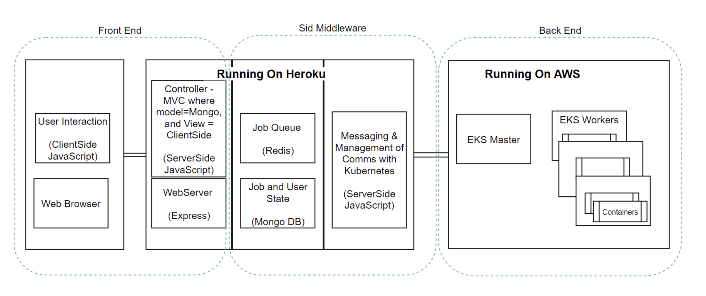
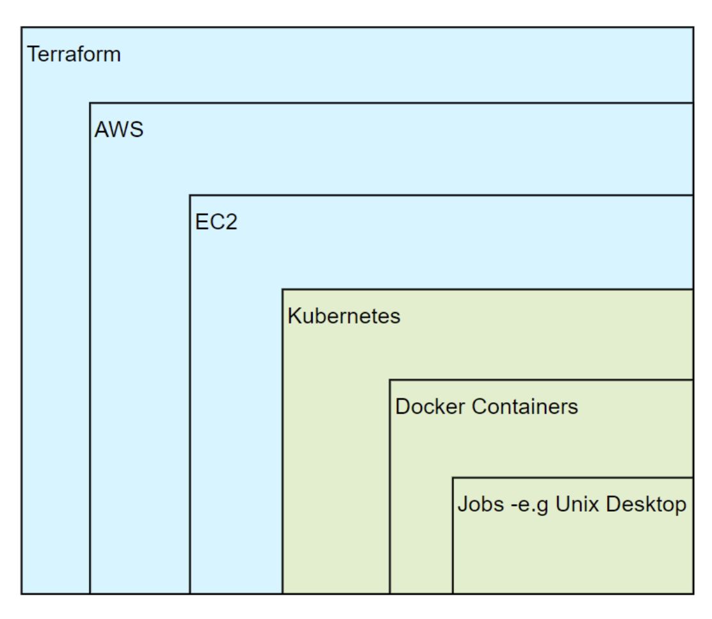

** **
# Create a Kubernetes based on-demand research computing environment in MOC

## 1.Vision and Goals Of The Project:

The cloud is full of unlimited computing power and storage, but managing it is not easy. Sid is a research tool that allows researchers to launch scientific computing environments, such as Jupyter Notebook and R Studio, on the cloud effortlessly.  

The architecture of Sid can be separated into 3 large components:
 - front-end, specficially a web interface
 - middleware, specifically API gateway, database for user information, scheduling services and communication modules to talk to back-end services
 - back-end, specfically a container infrastructure where kubernetes instances run on VMs, maintained by a cloud-operating system.

Currently, Sid's backend container infrastructure is powered by Amazon Elastic Kubernetes Service (EKS), which runs on AWS. The final goal of this project (by the end of this semester) is to **run Sid's backend container infrastructure on MOC via openstack.** In other words, we will replicate the functionalities of Amazon Elastic Kubernetes Service by developing a cloud operating system using openstack. The cloud operating system will deploy and manage new VMs on MOC. These VMs will run Kubernetes to host scientific computing environment as requested by the user (via the front-end interface).

## 2. Users/Personas Of The Project:

As a project mainly working on backend, the active users are the technicians of Sid. Sid's administrators and developers should eventually know how to deploy the same Sid computing environment on MOC with Kubernetes as on AWS.
- It targets the development team of Sid Cloud Based Research Computing.
- It does not target Sid's end users, like researchers and scientists who wish to utilize cloud computing environments simply via the Sid interface without knowing which cloud platform (MOC/AWS/Azure/GCP) is on.

## 3.   Scope and Features Of The Project:

#### Front End and Middleware
For the frontend and middleware solution, the work previously done by the Harvard SID team will serve as the foundation for the MOC implementation. Our goal is to use the provided Heroku code and host a instance on the MOC. We will not be doing any major adjustments to the current SID approach only ad-hoc tasks that prevent us from completing the implementation. 

#### Backend/Cloud
For the cloud portion of our solution, we will be designing a kubernetes based infrastructure that will work with the SID frontend/middleware solution provided and the tools currently provided by the MOC. The goal is to mimic the necessary features that SID uses with AWS, such as, EC2 instances and kubernetes support, and recreate them on the MOC infrastructure. This will prove the concept of being able to connect SID to a seperate cloud provider. A low priority focus has been placed on authentication and data protection.  

## 4. Solution Concept

### Global Architectural Structure Of the Project

<!--
This section provides a high-level architecture or a conceptual diagram showing the scope of the solution. If wireframes or visuals have already been done, this section could also be used to show how the intended solution will look. This section also provides a walkthrough explanation of the architectural structure.
-->

> Note that figures in this section come from the design documenation of Sid team.

The architecture of the current work is shown as below:

As shown in the figure, we can find that the Sid's Backend is currently built on AWS. The goal of our project is porting the same system (the whole system, not only the backend) onto Mass Open Cloud (MOC). Therefore, the main job is rebuild the backend to satisfy the MOC's environment.

The hierarchy of Sid's backend can be visualized as the following block diagram:

    

Our work is going to make the green block works on MOC by replacing the blue block layer. Due to the differences of features and functions between MOC and AWS, the blue block has to re-design to ensure the communications between Sid Middleware and Kubernetes services work properly.

### Design Implications and Discussion

<!--
This section discusses the implications and reasons of the design decisions made during the global architecture design.
-->

Some design concepts:
* **No OpenShift**:
The previous team has already prove that OpenShift works not as good as expectation. Thanks for them hard working, we can get rid of this option.

* **Combine the Kubernetes and OpenStack**:
Our goal is porting the current system onto MOC. The current Sid system uses Kubernetes to manage Docker containers. Meanwhile MOC provides OpenStack to manage VMs. Hence, we decided to use two techniques together. As we can observe, some companies have already used them together. Thus, we think this is viable.

* **Focus on "Blue Part"**: Since the front-end and Kubernetes environment are mature now, the team should focus on "blue part" of the diagram to ensure the whole system can run properly on MOC. At the same time, as the manager has mentioned, don't make any change to the "green block".

## 5. Acceptance criteria
minimum acceptance criteria:successfully replicate the Sid Project in the MOC environment. 
stretch goals:deal with the security aspects of Sid.
## 6.  Release Planning:

##### Sprint 1 (02/05/2020)
* Get development environment running
* MOC access
* Trying Openstack
* Trying Kubernetes

<!--
** **

## General comments

Remember that you can always add features at the end of the semester, but you can't go back in time and gain back time you spent on features that you couldn't complete.

** **
-->
