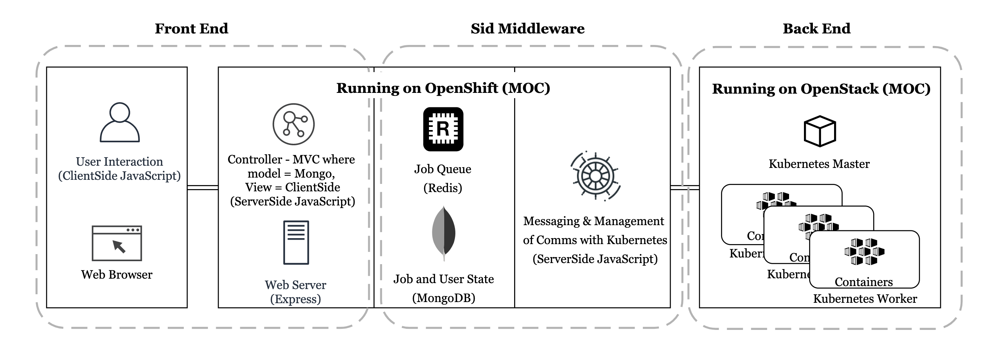
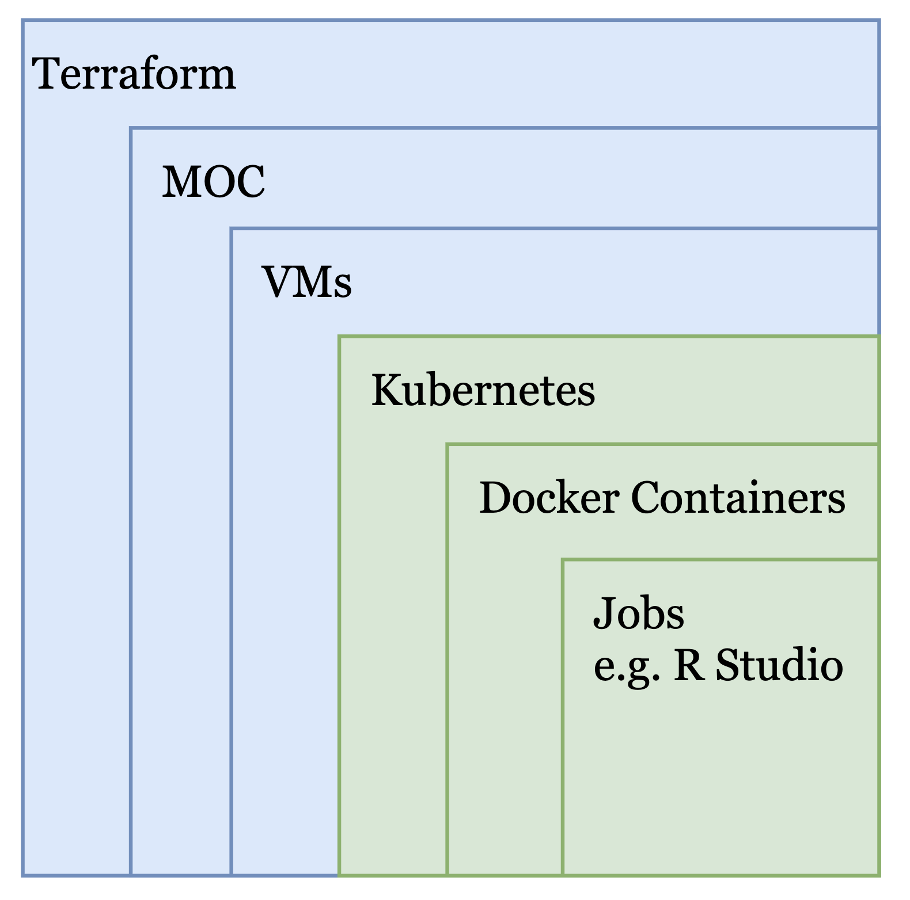
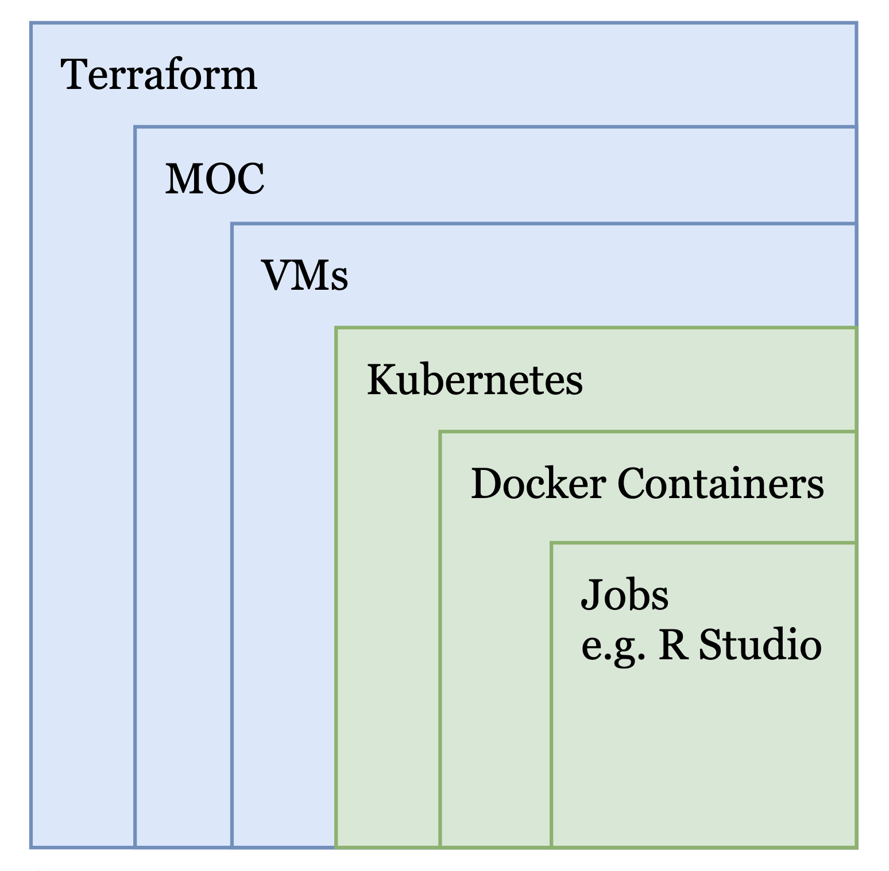

# Create a Kubernetes based on-demand research computing environment in MOC
**Mentor:** Mike Reekie

**Team:** Alex Wong, Bowen Qin, Mariano Pache, Sakhan Bhatia, Yuhao Zhou, Zeyu Song

**Final Presentation Video Link:** https://youtu.be/R7fXLZRtgi4

## 1.Vision and Goals Of The Project:

The cloud is full of unlimited computing power and storage, but managing it is not easy. Sid is a research tool that allows researchers to launch scientific computing environments, such as Jupyter Notebook and R Studio, on the cloud effortlessly.  

The architecture of Sid can be separated into 3 large components:
 - front-end, specficially a web interface
 - middleware, specifically API gateway, database for user information, scheduling services and communication modules to talk to back-end services
 - back-end, specfically a container infrastructure where kubernetes instances run on VMs, maintained by a cloud-operating system.

Currently, Sid's backend container infrastructure is powered by Amazon Elastic Kubernetes Service (EKS), which runs on AWS. The final goal of this project (by the end of this semester) is to **run Sid's backend container infrastructure on MOC via openstack.** In other words, we will replicate the functionalities of Amazon Elastic Kubernetes Service by developing a cloud operating system using openstack. The cloud operating system will deploy and manage new VMs on MOC. These VMs will run Kubernetes to host scientific computing environment as requested by the user (via the front-end interface).

More info about Sid: https://scholar.harvard.edu/sid

## 2. Users/Personas Of The Project:

As a project mainly working on backend, the active users are the technicians of Sid. Sid's administrators and developers should eventually know how to deploy the same Sid computing environment on MOC with Kubernetes as on AWS.
- It targets the development team of Sid Cloud Based Research Computing.
- It does not target Sid's end users, like researchers and scientists who wish to utilize cloud computing environments simply via the Sid interface without knowing which cloud platform (MOC/AWS/Azure/GCP) is on.

## 3.   Scope and Features Of The Project:

#### Front End and Middleware
In the original implemention of sid, the front-end and middleware was hosted on Heroku. In our implementation of Sid on MOC, we are hosting it on OpenShift.

#### Backend/Cloud
In the original implemention of sid, the front-end and middleware was hosted on Amazon EKS. In our implementation of Sid on MOC, we install kubernetes on top of VMs on OpenStack. On the kubernetes, we install the sid-backend image.

#### Automation Scripts
Creating automation scripts to deploy the entire sid software is the main focus of the project. We created Terraform and Kubespray/Ansible scripts to automatically deploy sid(front-end, middleware and backend/cloud).

To provide more details, in the front-end, we use a terraform script to deploy all the instances required. In the backend, we use Terraform to create all the resources and VMs required (including assigning master-slave VMs), and then use Kubespray (a cluster of Ansible scripts) to install Kubernetes onto the VMs.

<!--#### Front End and Middleware
For the frontend and middleware solution, the work previously done by the Harvard SID team will serve as the foundation for the MOC implementation. Our goal is to use the provided Heroku code and host a instance on the MOC. We will not be doing any major adjustments to the current SID approach only ad-hoc tasks that prevent us from completing the implementation.-->

<!--#### Backend/Cloud
For the cloud portion of our solution, we will be designing a kubernetes based infrastructure that will work with the SID frontend/middleware solution provided and the tools currently provided by the MOC. The goal is to mimic the necessary features that SID uses with AWS, such as, EC2 instances and kubernetes support, and recreate them on the MOC infrastructure. This will prove the concept of being able to connect SID to a seperate cloud provider. A low priority focus has been placed on authentication and data protection.-->

## 4. Solution Concept

### Global Architectural Structure Of the Project

<!--
This section provides a high-level architecture or a conceptual diagram showing the scope of the solution. If wireframes or visuals have already been done, this section could also be used to show how the intended solution will look. This section also provides a walkthrough explanation of the architectural structure.
-->

The architecture of the current work is shown as below:

> Note that figures in this section come from the design documenation of Sid team.

As shown in the figure, we can find that the Sid's Backend is currently built on AWS. The goal of our project is porting the same system (the whole system, not only the backend) onto Mass Open Cloud (MOC). Therefore, the main job is rebuild the backend to satisfy the MOC's environment.

The architecture of the our work is shown as below:

The hierarchy of Sid's backend can be visualized as the following block diagram:

    

Our work is going to make the green block works on MOC by replacing the blue block layer. Due to the differences of features and functions between MOC and AWS, the blue block has to re-design to ensure the communications between Sid Middleware and Kubernetes services work properly.

The hierarchy of Sid's backend of our work can be visualized as the following block diagram:

    

### Design Implications and Discussion

<!--
This section discusses the implications and reasons of the design decisions made during the global architecture design.
-->

Some design concepts:
* **OpenShift**:
We will be using OpenShift to containerize the front-end. The containers will be built and pushed into the OpenShift registry before building. Terraform is used to deploy the containers automatically. In all, OpenShift is used to deploy the front-end on OpenStack.

* **Combine the Kubernetes and OpenStack**:
Our goal is porting the current system onto MOC. The current Sid system uses Kubernetes to manage Docker containers. Meanwhile MOC provides OpenStack to manage VMs. Hence, we decided to use two techniques together. As we can observe, some companies have already used them together. Thus, we think this is viable.

* **Focus on "Blue Part"**: Since the front-end and Kubernetes environment are mature now, the team should focus on "blue part" of the diagram to ensure the whole system can run properly on MOC. At the same time, as the manager has mentioned, don't make any change to the "green block".

This document includes the technology and the procedures that we used : [Knowledge Document](https://github.com/BU-CLOUD-S20/MOC-Research-Computing/blob/master/Knowledge%20Documents%20.pdf)

### Step-by-Step Instruction to run Automation script.

The 'step-by-Step Instruction to run Automation script' document is located [here](https://github.com/BU-CLOUD-S20/MOC-Research-Computing/blob/master/Sid%20install.pdf)

#### Problemshooting
##### Authentication Problems
- For the current version terraform (v0.12.24), `OS_` prefix env variables doesn't work, please use `clouds.yaml` file instead (use application credential or username credential)
- To use Ansible Script, please use username credential via `OS_` prefix env variables (i.e. RC file). Otherwise, it might not work.

## 5. Acceptance criteria

**Initial Version**
 - **Minimum Acceptance Criteria:** successfully replicate Sid Project in the MOC environment
 - **Stretch Goals:** Deal with security aspect of Sid.

**Revised Version**

The initial version proved to be too much for us to complete by the due date. After discussing with the Harvard team, they were already impressed at our current progress and are content with us at where we are.

 - **Revised acceptance criteria:** Write 2 automation scripts; One to deploy the front end and middleware on Openshift, and the second, to install kubernetes in the backend. The automation script should be able to request for all the required resources (such as VM instances, security groups.etc) for the execution to take place.

## 6.  Release Planning:

##### Sprint 1 (02/05/2020)   - [Demo Slides](https://drive.google.com/open?id=143zmWe8QWx_mgSnVnRZh-ouzFL96VPx0)
* Get development environment running
* MOC access
* Trying Openstack
* Trying Kubernetes

##### Sprint 2 (02/26/2020)   - [Demo Slides](https://drive.google.com/open?id=1k5tufYwgwYa4eGq1knyiy0dHah0J6V94)
* Install Sid development environment on every teammates' computer
* Build Sid backend CLI
* Deploy master and slave node using Kubeadm
* Research on Kubernetes, OpenStack, OpenShift, Magnum, EKS

##### Ceph Paper Review (03/16/2020)   - [Demo Slides](https://drive.google.com/open?id=1_WevWllz4oGtsHG1JdnFqFl6_bS-MplD)

##### Sprint 3 - N/A
* Didn't do any sprint demo during Ceph Paper Review week

##### Sprint 4 (04/01/2020)   - [Demo Slides](https://drive.google.com/open?id=12DP1aVrxA2i03WMOxHbNmhVAwlpG3eV5)
* Use Terraform to create resources on MOC (OpenStack)
*	Manually deploy Kubernetes on OpenStack

##### Sprint 5 (04/15/2020)   - [Demo Slides](https://drive.google.com/open?id=1Mtqfh3GklQ0-ExeGrEvJREuvOIBQuyQ5)
Frontend: 
- Containerize front-end with OpenShift
- Using Terraform to deploy components automatically

Backend:
- Using Ansible / Kubespray to install Kubernetes on MOC
- Bugs located and fixed in Terraform resources creating scripts

##### Sprint 6 (04/29/2020)
 - Finalize Documentation;
   - [Step-by-Step Instructions to use automation scripts](https://github.com/BU-CLOUD-S20/MOC-Research-Computing/blob/master/Sid%20install.pdf)
   - [Knowledge Document](https://github.com/BU-CLOUD-S20/MOC-Research-Computing/blob/master/Knowledge%20Documents%20.pdf)
 - Fix bugs

## 7. Future Work

We have finshed the operations for the front-end, middleware and the backend. There have been minor changes with the target goal, but the Harvard team is content with the work we have produced.

This leaves us with a few tasks that can be done in the future:
 - Connecting all the components together.
 - Having end-to-end automation.

**Stretch future goal**

As more clients request for instances of jupyter notebook, R studio and Linux Desktops, we scale the pods.
In Kubernetes, this can be done easily using a feature called “Pod AutoScaler”. But what happens when the kubernetes workers have reached the maximum number of pods it can handle?

Kubernetes has another feature called “Cluster Autoscaler” that allows Kubernetes to talk to the cloud provider to ask for more clusters or VMs, in order to handle more pods.
However, this is where the problem lies. While this feature works with most cloud providers, such as AWS, Azure.etc, it is not supported on pure OpenStack. We mention pure openstack here, because it does work on Magnum, which is a library in OpenStack. However, the MOC openstack does not support Magnum.

After speaking with the Harvard MIT Data Center team, they said that they acknowledge that cluster autoscaling is not supported on the MOC and we cannot replicate the same thing they did on AWS. They said it is okay and that this part is not part of the scope of the project.

We discussed and agreed that technically, we could build a connector manually and make this work. But for now, we will leave it.

## 8. Directory summary
 - **terraform-sid-backend:** automation script to deploy backend
 - **terraform-oc:** automation script to deploy front-end and middleware
 - **Knowledge Documents .pdf:** files that documents configuration details and knowledge/ideas in this project
 - **Sid install.pdf:** installation and step-by-step instruction to run automation scripts
 - **Technology_Overview.pdf:** files that documents overview of technologies used (or previously researched)

<!--
** **

## General comments

Remember that you can always add features at the end of the semester, but you can't go back in time and gain back time you spent on features that you couldn't complete.

** **
-->

